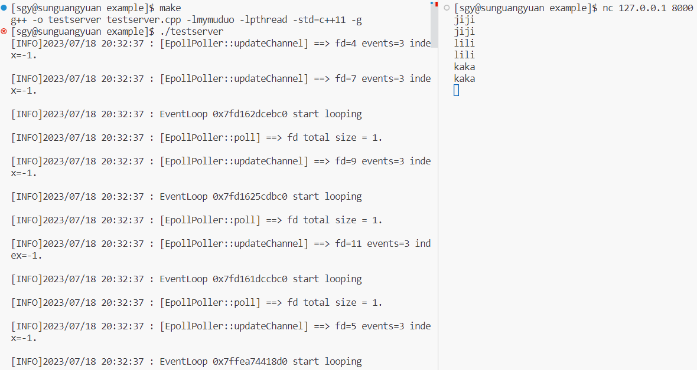

# muduo-based-on-C++11
Rewriting muduo network library source code in the core code based on C++11.

[CSDN万字详细的分析和说明：](https://blog.csdn.net/qq_44599368/article/details/131833423?spm=1001.2014.3001.5501)

# muduo网络库编程：

## muduo介绍：

一个基于`Reactor`反应堆模型的TCP多线程`C++`网络库。在多线程环境下，性能非常高。

## muduo源码编译安装：

### 关键步骤：

[Linux平台下muduo网络库源码编译安装](https://blog.csdn.net/QIANGWEIYUAN/article/details/89023980)

```shell
unzip nuduo-master.zip
cd ./muduo-master

# muduo是用cmake来构建的，需要先安装cmake
# ubuntu下直接：sudo apt-get install cmake
# redhat/centos可以从yum仓库直接安装：
sudo yum install cmake

./build.sh            # 运行源码编译构建程序 
./build.sh install    # 安装muduo库
# 注意：这里实际上是将muduo的include和lib文件夹，放在了同级目录下./build/release-install-cpp11下，即并没有把它们拷贝到系统路径下，导致我们每次编译程序都需要指定muduo库的头文件和库文件路径，太麻烦！！！
# 故需要直接把inlcude（头文件）和lib（库文件）目录下的文件拷贝到系统目录下，之后就不用再指定头文件和lib库文件路径信息了（g++会自动从`/usr/include`和`/usr/local/lib`路径下寻找所需要的文件）
cd ..
cd ./build/release-install-cpp11/include/
mv muduo/ /usr/include/
cd ./build/release-install-cpp11/lib/
mv * /usr/local/lib/
```

### 测试：

注意：vscode中，普通用户远程登录后，要操作linux下的文件，需要提前用root用户权限将该文件夹下所有文件所属于的用户和用户组，变更为远程登录的用户。

`test_muduo_echoServer.cpp`：

```c++
#include <iostream>
#include <muduo/net/TcpServer.h>
#include <muduo/base/Logging.h>
#include <boost/bind.hpp>
#include <muduo/net/EventLoop.h>

// using muduo developing the echo server  
class EchoServer
{
public:
    EchoServer(muduo::net::EventLoop* loop, const muduo::net::InetAddress& listenAddr);

    void start(); 
private:
    void onConnection(const muduo::net::TcpConnectionPtr& conn);

    void onMessage(const muduo::net::TcpConnectionPtr& conn, muduo::net::Buffer* buf, muduo::Timestamp time);

    muduo::net::TcpServer _server;
};

EchoServer::EchoServer(muduo::net::EventLoop* loop, const muduo::net::InetAddress& listenAddr) : _server(loop, listenAddr, "EchoServer")
{
    _server.setConnectionCallback(boost::bind(&EchoServer::onConnection, this, _1));
    _server.setMessageCallback(boost::bind(&EchoServer::onMessage, this, _1, _2, _3));
}

void EchoServer::start()
{
    _server.start();
}

void EchoServer::onConnection(const muduo::net::TcpConnectionPtr& conn)
{
    LOG_INFO << "EchoServer - " << conn->peerAddress().toIpPort() << " -> "
        << conn->localAddress().toIpPort() << " is "
        << (conn->connected() ? "UP" : "DOWN");
}

void EchoServer::onMessage(const muduo::net::TcpConnectionPtr& conn, muduo::net::Buffer* buf, muduo::Timestamp time)
{
    // 接收到所有的消息，然后回显
    muduo::string msg(buf->retrieveAllAsString());
    LOG_INFO << conn->name() << " echo " << msg.size() << " bytes, "
        << "data received at " << time.toString();
    conn->send(msg);
}

int main()
{
    LOG_INFO << "pid = " << getpid();
    muduo::net::EventLoop loop;
    muduo::net::InetAddress listenAddr(8888);
    EchoServer server(&loop, listenAddr);
    server.start();
    loop.loop();
    return 0;
}
```


## 准备工作：

### vscode远程连接linux：

[VSCode - 使用VSCode远程连接到Linux](https://blog.csdn.net/weixin_42490414/article/details/117750075)

### linux下配置boost库：

#### 编译安装步骤：

[boost库源码编译安装](https://blog.csdn.net/QIANGWEIYUAN/article/details/88792874)

```shell
tar -zxvf boost_1_69_0.tar.gz 
cd ./boost_1_69_0   

./bootstrap.sh     # 编译构建程序
./b2               # 运行b2程序

# 把上面的boost库头文件和lib库文件安装在默认的Linux系统头文件和库文件的搜索路径/usr/下，运行下面命令（因要给/usr目录下拷贝文件，需要先进入root用户）
su root
./b2 install
```

#### 潜在的问题：

centos boost fatal error: pyconfig.h: No such file or directory #include pyconfig.h。


##### 原因：

没有安装对应`python`的`python-dev`依赖，不然编译到`boost python`模块的时候就会出错。

##### 解决方案：

`centos` ==> `sudo yum install python-devel`

`ubuntu` ==> `sudo apt-get install python-dev`

验证：`/usr/include/python2.7`下，有了`pyconfig.h`文件。

#### 测试：

`test_boost_bind.cpp`

```c++
#include <iostream>
#include <boost/bind.hpp>
#include <string>
using namespace std;

class Hello
{
public:
	void say(string name) 
	{ cout << name << " say: hello world!" << endl; }
};

int main()
{
	Hello h;
	auto func = boost::bind(&Hello::say, &h, "zhang san");
	func();
	return 0;
}
```

编译运行：

```shell
g++ ./test_boost_bind.cpp -o test_boost_bind -std=c++11
./test_boost_bind
```

## 基于muduo库的服务器程序：

`muduo_server.cpp`：

```c++
/*
    1、采用的服务器模式“epoll + 线程池”，将网络IO与业务代码（用户的连接/断开、读/写操作）区分开
    2、muduo网络库给用户提供了两个主要的类：
        TcpServer : 用于编写服务器程序
        TcpClient : 用于编写客户端程序
*/
#include <muduo/net/TcpServer.h>
#include <muduo/net/EventLoop.h>
#include <functional>
#include <iostream>
#include <string>
using namespace std;
using namespace muduo;
using namespace muduo::net;

/* 
    基于muduo网络库开发服务器程序：
    1、组合TcpServer对象 ==> _server 
    2、创建EventLoop事件循环对象 ==> loop
    3、明确TcpServer构造函数 ==> TcpServer(EventLoop* loop, const InetAddress& listenAddr, const string& nameArg, Option option = kNoReusePort);
        3.1 给服务器注册用户连接和断开的回调函数
        3.2 给服务器注册用户读写操作回调函数
        3.3 设置合适的服务端线程数量，muduo库会将其分为1个IO线程、多个worker线程
    4、start()成员函数调用_server.start()，将listenfd添加到监听事件的红黑树上
    5、loop.loop()，阻塞等待事件就绪
*/
class ChatServer
{
public:
    // loop：事件循环、listenAddr：IP+Port、nameArg：服务器的名字
    ChatServer(EventLoop* loop, const InetAddress& listenAddr, const string& nameArg) : _server(loop, listenAddr, nameArg)
    {
        /* 通过绑定器设置回调函数 */
        // 给服务器注册用户连接和断开的回调函数
        _server.setConnectionCallback(std::bind(&ChatServer::onConnection, this, std::placeholders::_1));
        // 给服务器注册用户读写操作回调函数
        _server.setMessageCallback(std::bind(&ChatServer::onMessage, this, std::placeholders::_1, std::placeholders::_2, std::placeholders::_3));

        /* 给EventLoop设置合适的线程数 */
        _server.setThreadNum(4);    // 1个IO线程、3个worker线程
    }

    // 启动ChatServer服务
    void start()
    {
        _server.start();
    }
private:
    /* TcpServer中setConnectionCallback的回调函数 */
    // epoll、listen、accept ==> 专门处理用户的连接创建、断开
    // 用户定义的连接事件处理函数：当服务端接收到新连接建立请求，则打印Connection UP，如果是关闭连接请求，则打印Connection Down
    void onConnection(const TcpConnectionPtr& conn)
    {
        if (conn->connected())
        {
            cout << conn->peerAddress().toIpPort() << "->" << conn->localAddress().toIpPort() << "connected" << endl;
        }
        else 
        {
            cout << conn->peerAddress().toIpPort() << "->" << conn->localAddress().toIpPort() << "disconnected" << endl; 
        }
    }

    /* TcpServer中setMessageCallback的回调函数 */ 
    // 用户定义的可读事件处理函数：当一个Tcp连接发生了可读事件就把它这个接收到的消息原封不动的还回去
    void onMessage(const TcpConnectionPtr& conn, Buffer* buffer, Timestamp time)  // Buffer指向缓冲区，Timestamp指接收到数据的时间信息
    {
        // 这里只是将client发送到server的数据，原封不动的搬回去
        string buf = buffer->retrieveAllAsString();
        cout << time.toString() << ", received data : " << buf << endl;
        conn->send(buf);
        
        // 此时连接断开，即可回收文件句柄资源（关闭写端）
        conn->shutdown();    // 关闭写端，EPOLLHUP ==> closeCallback_
        /* 通过调整该语句的位置到onConnection()函数else判断条件的最后，可实现多条语句的持续发送 */
    }

    muduo::net::TcpServer _server;
};


int main()
{
    EventLoop loop;                       // 类似于创建一个epoll 
    InetAddress addr("127.0.0.1", 8000);  // server端监听的IP+Port
    ChatServer chatserver(&loop, addr, "chatServer");

    chatserver.start();  // 启动server：listenfd ==> acceptChannel ==> mainLoop
    loop.loop();         // 启动mainLoop底层的poller，开启事件循环监

    return 0;
}
```


## 基于muduo库的客户端程序：

```c++
/* 客户端实现，基于C++ muduo网络库 */
class ChatClient
{
public:
	ChatClient(muduo::net::EventLoop *loop, const muduo::net::InetAddress &addr) :_client(loop, addr, "ChatClient")
    {
        // 设置客户端TCP连接回调接口
        _client.setConnectionCallback(bind(&ChatClient::onConnection, this, _1));
        // 设置客户端接收数据回调接口
        _client.setMessageCallback(bind(&ChatClient::onMessage, this, _1, _2, _3));
    }
	// 连接服务器 
    void connect()
    {
    	_client.connect();
    }
private:
    // TcpClient绑定回调函数，当连接或者断开服务器时调用
    void onConnection(const muduo::net::TcpConnectionPtr &con);
    // TcpClient绑定回调函数，当有数据接收时调用
    void onMessage(const muduo::net::TcpConnectionPtr &con, muduo::net::Buffer *buf, muduo::Timestamp time);
    muduo::net::TcpClient _client;
};
```

# 项目编译和安装：

## 编译：

使用`CMakeLists.txt`文件，在Linux上简单和可重复的方式来构建C++项目。

```shell
# 在项目根目录中创建一个名为 build 的目录，并在其中运行 CMake 工具。
mkdir build
cd ./build
cmake ..

# 在 build 目录中运行您生成的构建系统来构建项目
make
```

## 本项目库的安装：

```shell
# 在源码的目录中，有一个autobuild.sh文件，运行即可
su root
./autobuild.sh
# 运行之后，会将头文件存放在/usr/include/mymuduo文件夹下，将CMakeLists.txt编译好的动态库，放在/usr/lib下
```

# 项目测试代码：

```shell
# 写了一个回显服务器程序用于测试，在源码链接的`/example`目录下
cd ./example
make
./testserver  # 即可使用客户端连接到本机IP（127.0.0.1）的8000端口，来请求该回显服务器
```


